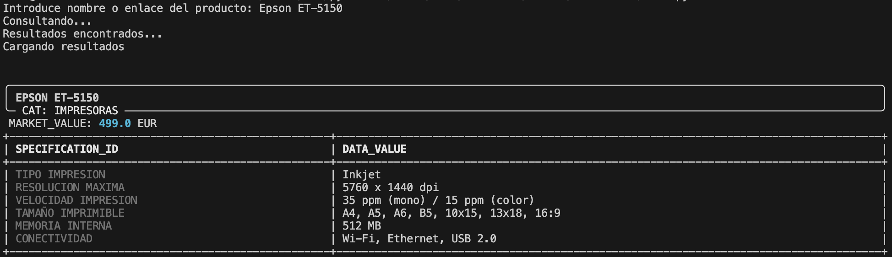

# Product Data Extractor

Este script automatiza la extracción de especificaciones técnicas y precios de productos utilizando la API gratuita del modelo Hermes-3 (Llama 3.1 8B). El objetivo principal es transformar una consulta de usuario o un enlace en un objeto JSON estructurado y presentarlo de forma legible en la terminal.

## Librerías

Para ejecutar este script, es necesario instalar las siguientes dependencias externas (encontradas en requirements.txt):

* **openai**: Se utiliza para interactuar con el modelo Hermes-3. Aunque el modelo no es de OpenAI, el endpoint es compatible con su SDK, lo que facilita la gestión de mensajes y parámetros de generación.
* **rich**: Se encarga de toda la interfaz visual en la terminal. Permite generar tablas dinámicas, paneles y dar formato al texto para que la lectura de datos técnicos no sea pesada.

El resto de módulos (`json`, `os`, `time`) pertenecen a la librería estándar de Python, por lo que no requieren instalación adicional.

## Funcionamiento del código

El script sigue un flujo de tres pasos:

1. **Consulta al modelo**: Se envía un prompt diseñado para que la IA actúe exclusivamente como un extractor de datos. Se utiliza una temperatura baja (0.1) para reducir alucinaciones y asegurar que los datos técnicos sean precisos.
2. **Limpieza de respuesta**: El código incluye una lógica para detectar y eliminar los bloques de código Markdown (```json) que los modelos de lenguaje suelen añadir, permitiendo que la función `json.loads` procese el contenido sin errores.
3. **Representación visual**: La función `render_product_data` procesa el JSON resultante. Convierte las llaves de tipo snake_case a un formato de texto amigable y genera una tabla con las especificaciones técnicas encontradas.


Al iniciar, solo hay que introducir el nombre de un producto o una URL. El sistema mostrará una ficha técnica detallada con el valor comercial y las caracteristicas del producto.



## Notas técnicas
* El modelo está forzado a devolver null en campos donde no encuentre información verídica para evitar datos inventados.
* Los precios se estandarizan a formato float en EUR para facilitar posteriores cálculos si se desea escalar el script.
